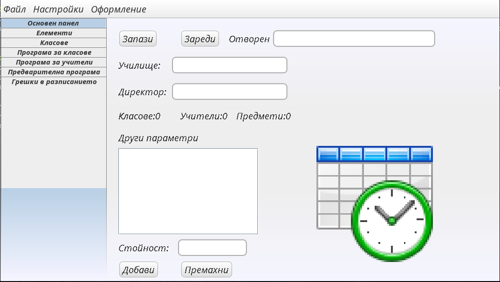
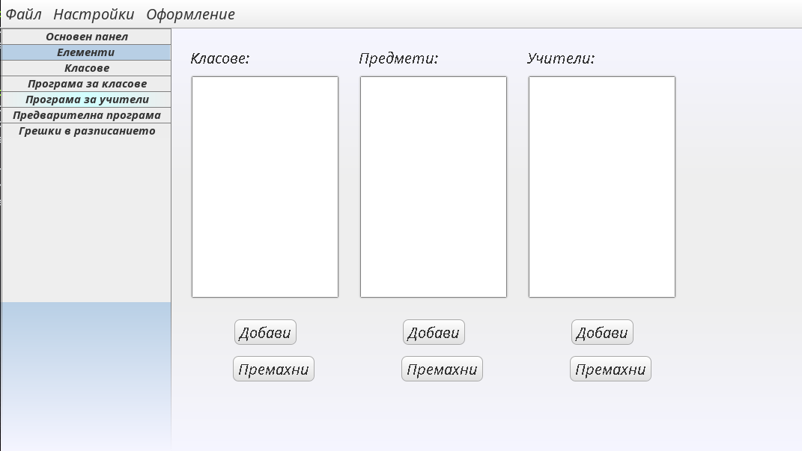
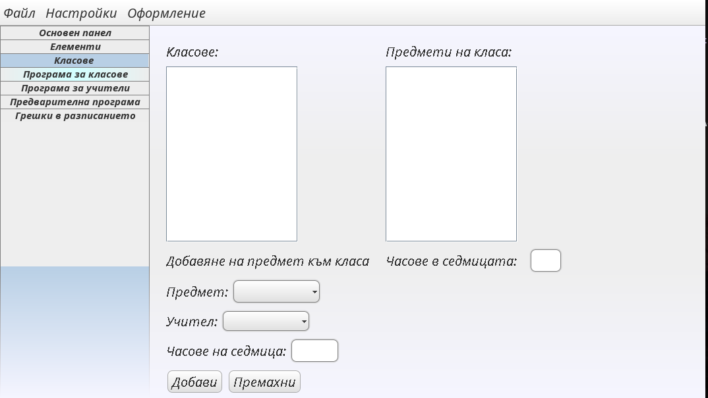
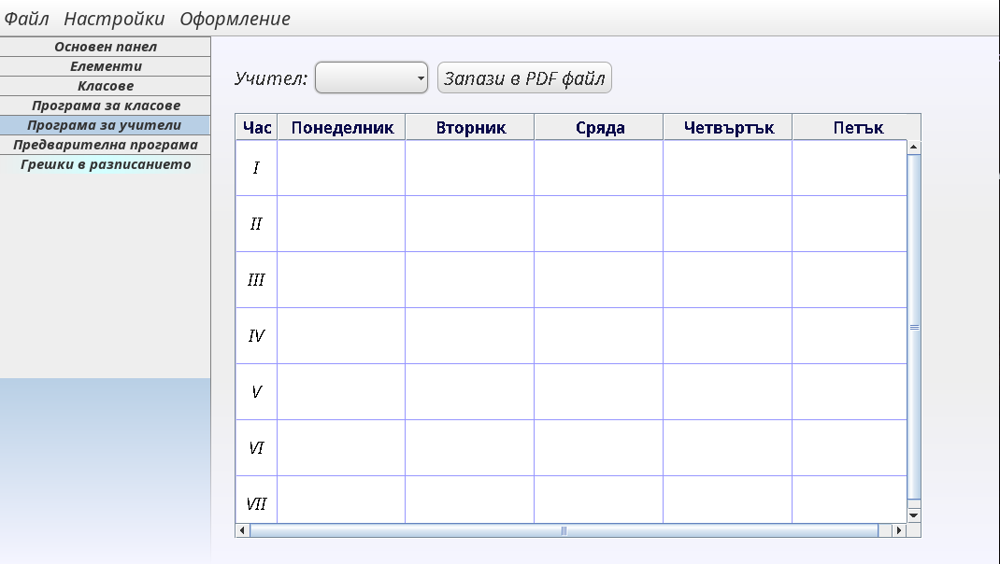

# Advance Resources Management


This is an early project of mine. It is an application written in java that is meant to generate a school program. Given some conditions like how many of each sujects each class in a school must have and what teachers are available for this subject, the application tries to efficiently allocate classes and teachers in time slots over the week.


I developed the program when I was in the high school and the project &ldquo;secured&rdquo; me a good spot in the rankings of the national competition for IT in Bulgaria. The application was targeted at bulgarian users so the UI is in bulgarian.


## Screenshots

Here are some screenshots from the application. If you are not a bulgarian, it&rsquo;ll probably not make any sense to you but&#x2026; enjoy anyway.

   


## Building

The whole thing was programmed in java (8). Originally I used only [Netbeans](https://netbeans.org/) for the development and I had no idea what &ldquo;build system&rdquo; was. Recently, however, I took the time to make the project buildable with [gradle](https://gradle.org/). Now, hopefully, it can be build on any system that supports some JVM and gradle for building.

Simply cloning and building the target `fatJar` should do everything:

```sh
git clone https://github.com/palikar/AdvancedResouceMenaging
gradle fatJar
```

To run the application:

```sh
java -jar ./build/libs/AdvancedResouceMenaging-all.jar
```
